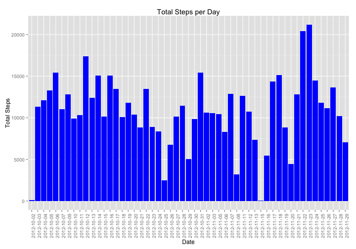
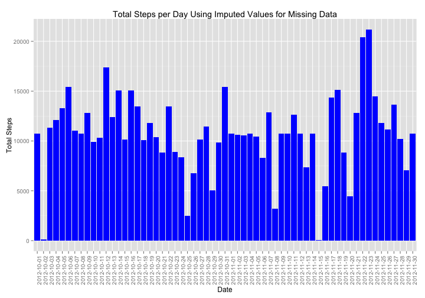
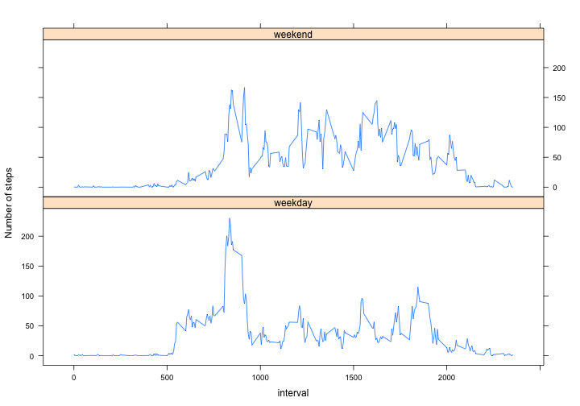

# Reproducible Research: Peer Assessment 1


```r
#title: Reproducible Research: Peer Assessment 1
#author: "Daniel Davenport"
#date: "August 10, 2014"
#output: html_document
```
  
## Loading and preprocessing the data

```r
#Load the libraries
library(grid)
library(ggplot2)
```

```
## Use suppressPackageStartupMessages to eliminate package startup messages.
```

```r
library(gridExtra)
library(xtable)
library(lattice)
#Set the working directory
setwd("/Users/ddavenport/Documents/DataScienceSpecialization/ReproducibleResearch/CourseProject1/RepData_PeerAssessment1")
#Disable scientific notation in printing
options(scipen=999)
#Load the data
unzip("activity.zip")
activitydata<-read.csv("activity.csv")
```


## What is mean total number of steps taken per day?

```r
#Disable scientific notation in printing
options(scipen=999)

#Compute the mean total steps per day (NA are not omitted)
stepsperday<-aggregate(steps ~ date, data=activitydata, sum)

#Get the mean total steps for all days
meansteps<-mean(stepsperday$steps)

#Get the median total steps for all days
mediansteps<-median(stepsperday$steps)

#Rotate the x-axis labels 90 degrees
xrotate<-theme(axis.text.x = element_text(angle = 90, hjust = 1))
#Plot the data
ggplot(data = stepsperday) + geom_histogram(aes(x=date, y=steps), fill="blue", stat="identity") + ylim(0,max(stepsperday$steps)) + ylab("Total Steps") + xlab("Date") + ggtitle("Total Steps per Day") + xrotate
```

 
  
The mean total number of steps for all days is 10766.1887.  
The median total number of steps for all days is 10765.  


```r
#Disable scientific notation in printing
options(scipen=999)
#Print the data as an information table
pDataTable<-xtable(stepsperday, type = "html", include.rownames = F, floating=FALSE)
print(pDataTable, type="html")
```

<!-- html table generated in R 3.1.1 by xtable 1.7-3 package -->
<!-- Sun Aug 10 16:01:29 2014 -->
<TABLE border=1>
<TR> <TH>  </TH> <TH> date </TH> <TH> steps </TH>  </TR>
  <TR> <TD align="right"> 1 </TD> <TD> 2012-10-02 </TD> <TD align="right"> 126 </TD> </TR>
  <TR> <TD align="right"> 2 </TD> <TD> 2012-10-03 </TD> <TD align="right"> 11352 </TD> </TR>
  <TR> <TD align="right"> 3 </TD> <TD> 2012-10-04 </TD> <TD align="right"> 12116 </TD> </TR>
  <TR> <TD align="right"> 4 </TD> <TD> 2012-10-05 </TD> <TD align="right"> 13294 </TD> </TR>
  <TR> <TD align="right"> 5 </TD> <TD> 2012-10-06 </TD> <TD align="right"> 15420 </TD> </TR>
  <TR> <TD align="right"> 6 </TD> <TD> 2012-10-07 </TD> <TD align="right"> 11015 </TD> </TR>
  <TR> <TD align="right"> 7 </TD> <TD> 2012-10-09 </TD> <TD align="right"> 12811 </TD> </TR>
  <TR> <TD align="right"> 8 </TD> <TD> 2012-10-10 </TD> <TD align="right"> 9900 </TD> </TR>
  <TR> <TD align="right"> 9 </TD> <TD> 2012-10-11 </TD> <TD align="right"> 10304 </TD> </TR>
  <TR> <TD align="right"> 10 </TD> <TD> 2012-10-12 </TD> <TD align="right"> 17382 </TD> </TR>
  <TR> <TD align="right"> 11 </TD> <TD> 2012-10-13 </TD> <TD align="right"> 12426 </TD> </TR>
  <TR> <TD align="right"> 12 </TD> <TD> 2012-10-14 </TD> <TD align="right"> 15098 </TD> </TR>
  <TR> <TD align="right"> 13 </TD> <TD> 2012-10-15 </TD> <TD align="right"> 10139 </TD> </TR>
  <TR> <TD align="right"> 14 </TD> <TD> 2012-10-16 </TD> <TD align="right"> 15084 </TD> </TR>
  <TR> <TD align="right"> 15 </TD> <TD> 2012-10-17 </TD> <TD align="right"> 13452 </TD> </TR>
  <TR> <TD align="right"> 16 </TD> <TD> 2012-10-18 </TD> <TD align="right"> 10056 </TD> </TR>
  <TR> <TD align="right"> 17 </TD> <TD> 2012-10-19 </TD> <TD align="right"> 11829 </TD> </TR>
  <TR> <TD align="right"> 18 </TD> <TD> 2012-10-20 </TD> <TD align="right"> 10395 </TD> </TR>
  <TR> <TD align="right"> 19 </TD> <TD> 2012-10-21 </TD> <TD align="right"> 8821 </TD> </TR>
  <TR> <TD align="right"> 20 </TD> <TD> 2012-10-22 </TD> <TD align="right"> 13460 </TD> </TR>
  <TR> <TD align="right"> 21 </TD> <TD> 2012-10-23 </TD> <TD align="right"> 8918 </TD> </TR>
  <TR> <TD align="right"> 22 </TD> <TD> 2012-10-24 </TD> <TD align="right"> 8355 </TD> </TR>
  <TR> <TD align="right"> 23 </TD> <TD> 2012-10-25 </TD> <TD align="right"> 2492 </TD> </TR>
  <TR> <TD align="right"> 24 </TD> <TD> 2012-10-26 </TD> <TD align="right"> 6778 </TD> </TR>
  <TR> <TD align="right"> 25 </TD> <TD> 2012-10-27 </TD> <TD align="right"> 10119 </TD> </TR>
  <TR> <TD align="right"> 26 </TD> <TD> 2012-10-28 </TD> <TD align="right"> 11458 </TD> </TR>
  <TR> <TD align="right"> 27 </TD> <TD> 2012-10-29 </TD> <TD align="right"> 5018 </TD> </TR>
  <TR> <TD align="right"> 28 </TD> <TD> 2012-10-30 </TD> <TD align="right"> 9819 </TD> </TR>
  <TR> <TD align="right"> 29 </TD> <TD> 2012-10-31 </TD> <TD align="right"> 15414 </TD> </TR>
  <TR> <TD align="right"> 30 </TD> <TD> 2012-11-02 </TD> <TD align="right"> 10600 </TD> </TR>
  <TR> <TD align="right"> 31 </TD> <TD> 2012-11-03 </TD> <TD align="right"> 10571 </TD> </TR>
  <TR> <TD align="right"> 32 </TD> <TD> 2012-11-05 </TD> <TD align="right"> 10439 </TD> </TR>
  <TR> <TD align="right"> 33 </TD> <TD> 2012-11-06 </TD> <TD align="right"> 8334 </TD> </TR>
  <TR> <TD align="right"> 34 </TD> <TD> 2012-11-07 </TD> <TD align="right"> 12883 </TD> </TR>
  <TR> <TD align="right"> 35 </TD> <TD> 2012-11-08 </TD> <TD align="right"> 3219 </TD> </TR>
  <TR> <TD align="right"> 36 </TD> <TD> 2012-11-11 </TD> <TD align="right"> 12608 </TD> </TR>
  <TR> <TD align="right"> 37 </TD> <TD> 2012-11-12 </TD> <TD align="right"> 10765 </TD> </TR>
  <TR> <TD align="right"> 38 </TD> <TD> 2012-11-13 </TD> <TD align="right"> 7336 </TD> </TR>
  <TR> <TD align="right"> 39 </TD> <TD> 2012-11-15 </TD> <TD align="right">  41 </TD> </TR>
  <TR> <TD align="right"> 40 </TD> <TD> 2012-11-16 </TD> <TD align="right"> 5441 </TD> </TR>
  <TR> <TD align="right"> 41 </TD> <TD> 2012-11-17 </TD> <TD align="right"> 14339 </TD> </TR>
  <TR> <TD align="right"> 42 </TD> <TD> 2012-11-18 </TD> <TD align="right"> 15110 </TD> </TR>
  <TR> <TD align="right"> 43 </TD> <TD> 2012-11-19 </TD> <TD align="right"> 8841 </TD> </TR>
  <TR> <TD align="right"> 44 </TD> <TD> 2012-11-20 </TD> <TD align="right"> 4472 </TD> </TR>
  <TR> <TD align="right"> 45 </TD> <TD> 2012-11-21 </TD> <TD align="right"> 12787 </TD> </TR>
  <TR> <TD align="right"> 46 </TD> <TD> 2012-11-22 </TD> <TD align="right"> 20427 </TD> </TR>
  <TR> <TD align="right"> 47 </TD> <TD> 2012-11-23 </TD> <TD align="right"> 21194 </TD> </TR>
  <TR> <TD align="right"> 48 </TD> <TD> 2012-11-24 </TD> <TD align="right"> 14478 </TD> </TR>
  <TR> <TD align="right"> 49 </TD> <TD> 2012-11-25 </TD> <TD align="right"> 11834 </TD> </TR>
  <TR> <TD align="right"> 50 </TD> <TD> 2012-11-26 </TD> <TD align="right"> 11162 </TD> </TR>
  <TR> <TD align="right"> 51 </TD> <TD> 2012-11-27 </TD> <TD align="right"> 13646 </TD> </TR>
  <TR> <TD align="right"> 52 </TD> <TD> 2012-11-28 </TD> <TD align="right"> 10183 </TD> </TR>
  <TR> <TD align="right"> 53 </TD> <TD> 2012-11-29 </TD> <TD align="right"> 7047 </TD> </TR>
   </TABLE>

## What is the average daily activity pattern?  

```r
#Disable scientific notation in printing
options(scipen=999)
#Get the mean number of steps by interval across all days
meanstepsbyinterval<-aggregate(activitydata$steps,by=list(activitydata$interval), FUN=mean, na.rm=TRUE)
names(meanstepsbyinterval)<-c("interval","steps")
#Create a time series 
x<-ts(meanstepsbyinterval$interval)
y<-ts(meanstepsbyinterval$steps)
#Find the row with the maximum mean steps
maxsteps<-subset(meanstepsbyinterval,meanstepsbyinterval$steps==max(meanstepsbyinterval$steps))
#Plot the data
plot(x,y, type="l",xlab="interval",ylab="steps",main="Average Number of Steps Taken, Averaged Across All Days ")
```

 


Across all the days in the dataset, the interval 835 contains the maximum mean number of steps (206.1698).   

## Imputing missing values


```r
#Disable scientific notation in printing
options(scipen=999)

#Calculate and report the total number of missing values in the dataset (i.e. the total number of rows with NAs)
numNA<-length(which(is.na(activitydata$steps)))

#Devise a strategy for filling in all of the missing values in the dataset. The strategy does not need to be sophisticated. For example, you could use the mean/median for that day, or the mean for that 5-minute interval, etc.
#Create a new dataset that is equal to the original dataset but with the missing data filled in.

#First, create a copy of the data frames so that we are not changing activitydata (and also to make the names shorter)
ad<-activitydata
msi<-meanstepsbyinterval
#Row, by row, if the steps value in ad is NA, lookup the mean value for that interval across all days
#There must be a simpler, more readable way to accomplish this but it does work
for (i in 1:length(ad$steps)) {if (is.na(ad[i,"steps"])) ad[i,"steps"]<-msi[msi[,"interval"]==ad[i,"interval"],"steps"]}
#The original data frame with NA is activitydata; the new data frame with imputed values is named ad

#Make a histogram of the total number of steps taken each day and calculate and report the mean and median total number of steps taken per day. Do these values differ from the estimates from the first part of the assignment? What is the impact of imputing missing data on the estimates of the total daily number of steps?

#Prefix object names with "i" to distinguish those with imputed values
#Compute the mean total steps per day using imputed values
istepsperday<-aggregate(steps ~ date, data=ad, sum)

#Get the mean total steps for all days
imeansteps<-mean(istepsperday$steps)

#Get the median total steps for all days
imediansteps<-median(istepsperday$steps)

#Rotate the x-axis labels 90 degrees
xrotate<-theme(axis.text.x = element_text(angle = 90, hjust = 1))
#Plot the data
ggplot(data = istepsperday) + geom_histogram(aes(x=date, y=steps), fill="blue", stat="identity") + ylim(0,max(istepsperday$steps)) + ylab("Total Steps") + xlab("Date") + ggtitle("Total Steps per Day Using Imputed Values for Missing Data") + xrotate
```

 

The number of missing values in the dataset is 2304.  
The mean total number of steps for all days (original data with NAs) is 10766.1887.   
The mean total number of steps for all days with imputed values substitued for NA is 10766.1887.    
The median total number of steps for all days (original data with NAs) is 10765.  
The median total number of steps for all days with imputed values substitued for NA is 10766.1887.  
There is little impact from imputing missing data on the estimates of the total daily number of steps.  

## Are there differences in activity patterns between weekdays and weekends?


```r
#For this part the weekdays() function may be of some help here. Use the dataset with the filled-in missing values for this part.

#Disable scientific notation in printing
options(scipen=999)

#Create a new factor variable in the dataset with two levels – “weekday” and “weekend” indicating whether a given date is a weekday or weekend day.
daygroup<-c()
for (i in 1:length(ad$date)) {if (weekdays(as.POSIXct(as.character(ad[i,"date"]))) %in% c("Monday","Tuesday","Wednesday","Thursday","Friday")) daygroup<-append(daygroup, c("weekday")) else daygroup<-append(daygroup, c("weekend"))}
daygroup<-as.factor(daygroup)
ad<-cbind(ad,daygroup)

#Make a panel plot containing a time series plot (i.e. type = "l") of the 5-minute interval (x-axis) and the average number of steps taken, averaged across all weekday days or weekend days (y-axis). 

msi<-aggregate(ad$steps,by=list(ad$interval,ad$daygroup), FUN=mean)
names(msi)<-c("interval","daygroup","steps")
xyplot(steps~interval|daygroup,msi, panel=function(x,y){panel.xyplot(ts(x),ts(y),type="l")},layout=c(1,2),ylab="Number of steps")
```

 

In general, on weekends the data shows that the subject is more consistently active; on weekends the subject tends to be more sedentary after a period of high activity mid-morning.  
